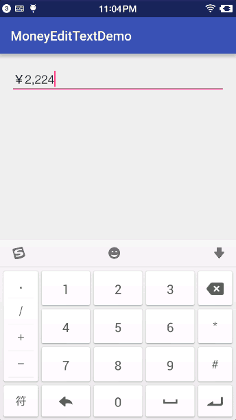

# CurrencyEditText
[](https://jitpack.io/#yuhaocan/CurrencyEditText)
>
Currency text EditTextView

# Screenshots


# Usage
## Step 1. Add it in your root build.gradle at the end of repositories:

```
allprojects {
		repositories {
			...
			maven { url 'https://jitpack.io' }
		}
	}
```
## Step 2. Add the dependency([See Latest release](https://jitpack.io/#yuhaocan/MoneyEditText/0.1702192314))
```
dependencies {
		compile 'com.github.yuhaocan:MoneyEditText:+'
	}
```
## Step 3. Add to layout
```
<com.julyyu.moneyeditext.MoneyEditText
        android:id="@+id/money_edittext"
        android:layout_width="match_parent"
        android:layout_height="wrap_content"
        android:hint="不带货币符号和小数"
        apps:numdecimal="0"
        apps:symbolshow="false"
        />
``` 
parameter | Description
----------|------------
numdecimal | Decimal number
symbolshow | Currency symbol display
## 
# TODO LIST
- [x] 基础功能实现
- [ ] 从中间输入数字光标定位在当前位置
- [x] 添加attrs参数(金额显示位数/小数点显示位数/金额颜色/是否显示货币符号...)
- [x] 支持货币金额转float类型数值
- [x] 小数点第一位可为0

